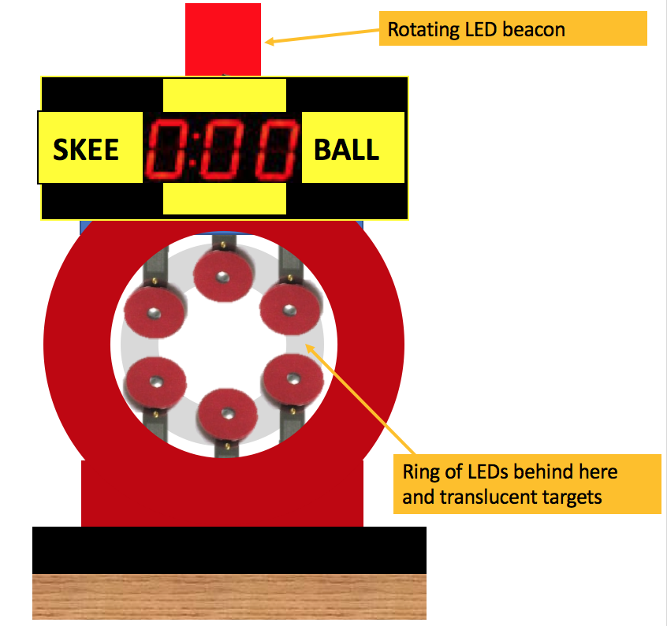
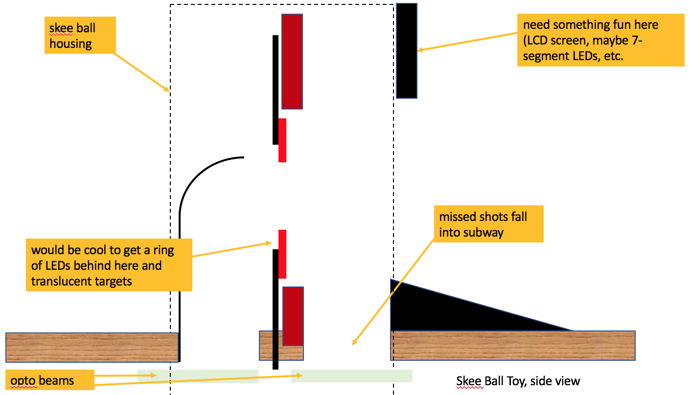

Main Toy (Skee Ball?)
=====================

*State Fair Pinball* will have some kind of main toy in the upper
center-left. Hitting this toy will cause one of two (or three)
things to happen:

* The ball is returned back to the player
* The ball is dropped into the subway and into the lower left VUK
* (Maybe?) The ball can be locked into this device

The lower left VUK will have the ability to hold a few balls,
so this toy doesn't need one unless something makes sense for the
visual appearance.

We also need to figure out what the point of this central toy is.
Is it just another carnival game or attraction? If so, why's it hit
so much versus other things that are just modes?

Since tickets are so central to the game, could it have something
to do with them? But what? Collecting prizes? Cashing them out?

Then again, not every game has a central toy. MB, STTNG, CFTBL, TZ, IJTPA, AF...
So we might be able to get away without it.

Potential options:

* Some kind of ride. Spinny thing / ferris wheel thing that can hold some
  balls in it.
* Skee ball or something with a little ramp and holes the ball goes through?
  (Probably needs too much room since the holes would have to be big enough
  to let the balls through. Then again, people really love skee ball.
* Could be a wide ramp, like Demolition Man or Whodunnit that launches balls
  into a vertical target bank. There should be a gab in front so the ball
  falls down into the subway.
* Could we combine the two, with a central hole and targets around? Would be
  crazy to have a donut magnet that could be a helper to suck the ball through. :)

Whatever it is, it should be satisfying to shoot.

Skee Ball Option
----------------

If we do a skee ball option, it could look something like this:

* Ring of targets.
* If the ball hits a target, it bounces back and either falls into a slot in the front or back
  down the ramp.
* If the ball makes it through, it goes into the subway.
* Ring of targets can have an LED ring behind them (and maybe they're translucent) for different effects.
* Top front of machine has a 7-segment display. Maybe that's where the player's current ticket score is, or
  maybe it tracks something else (total skee ball points or something)
* Rotating red LED beacon on top of the machine for shots made.

